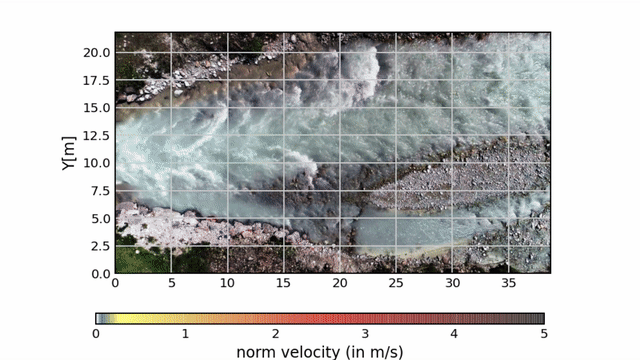


# About

OpyFlow : Python package for Optical Flow measurements.


Opyf is based on openCV and VTK libraries to detect good features to track, calculate the optical flow by Lukas Kanade method and interpolate them on a mesh (see explanation below). The package contains also some rendering tools built with matplotlib. Velocities can be exported (csv,tecplot, vtk, hdf5).
For flow calculations, the process is mainly inspired on the openCV python sample lktrack.py.

Author: Gauthier Rousseau

Corresponding e-mail : gauthier.rousseau@gmail.com

## Quick start

Assuming that you already have an environment with python installed (<=3.7), run the following command from the package repository:

```shell
python setup.py install
```

This should install the opyf library and the main dependencies (vtk and opencv) automatically (for anaconda installaion see bellow).

To analyze a frame sequence (*png*, *bmp*, *jpeg*, *tiff*) run the following script:

```python
import opyf
analyzer=opyf.frameSequenceAnalyzer("folder/toward/images")
```

For a video (*mp4*, *avi*, *mkv*, ... ):

```python
analyzer=opyf.videoAnalyzer("video/file/path")
```

To run your first analyze run :

```python
analyzer.extractGoodFeaturesAndDisplacements()
```

opyf package contains 2 frames and one video for testing and practicing your self :

- Two frames from the Test case A of the *PIV Challenge 2014*

When applied to the entire dataset, It can produce the following result (see [Test PIV Challenge 2014 - Case A](test/Test_case_PIV_Challenge_2014/testPIVChallengeCaseA.md) for details on the procedure).

- A bird eye view video of a stream river taken by a drone from which surface velocities can be extracted ([see the following python file for the different possible procedures](test/Test_Navizence/test_opyf_Navizence.py) ).



## Contents

This archive is organized as follow:

The setup file:

- setup.py

The package Folder opyf:

- opyf

  - Track.py
  - Interpolate.py
  - Files.py
  - Filters.py
  - Render.py
  - custom_cmap.py (based on Chris Slocum file)

The test Folder:

- test

  - Test_case_PIV_Challenge_2014

    - CommandLines-Opyf-PIV-Challenge2014-Test.py

    - CommandLines-Opyf-PIV-Challenge2014-Test_Simple.py

    - mask.tiff

    - images (sample of 2 source images)

      - A_00001_a.tif
      - A_00001_b.tif
    - ReadMe_Download_Images.txt (instruction to download the entire image sequence of the test)
    - meanFlow.png (Results for the CommandLines)
    - rms.png
    - [testPIVChallengeCaseA.md](test/Test_case_PIV_Challenge_2014/testPIVChallengeCaseA.md)

  - Test_land_slide_youtube_video
    - OpyFlow_testcase_youtube_MA.py
    - OpyFlow_testcase_youtube_simple.py
    - mask.png
    - The video must be downloaded from youtube with the package pytube
    - ReadMe_download_a_youtube_video.txt (instruction to download the video)
  - Test_Navizence
    - [2018.07.04_Station_fixe_30m_sample.mp4](test/Test_Navizence/2018.07.04_Station_fixe_30m_sample.mp4)
    - [test_opyf_Navizence.py](test/Test_Navizence/test_opyf_Navizence.py)

One test file performed on the PIV challenge 2014 caseA (images on<http://www.pivchallenge.org/pivchallenge4.html#case_a):>
The results are compared to the main findings of the challenge:
``-Kähler CJ, Astarita T, Vlachos PP, Sakakibara J, Hain R, Discetti S, Foy RL, Cierpka C, 2016, Main results of the 4th International PIV Challenge, Experiments in Fluids, 57: 97.''

A test on synthetic images is still required.

## Installation with anaconda

The package requires python and basic python package: csv, numpy, matplotlib, tqdm

The main dependencies are :

OpenCV
VTK

The code use last versions of VTK and openCV.
However, pip (Python Package Index) doesn't have the last vtk yet.
It is also a bit tricky to compile the source directly from the vtk website.
However, the simplest way to install it is to use miniconda or anaconda and the last updated sources from conda-forge.

When miniconda/anaconda is installed type in the command prompt:

conda create -n opyfenv vtk opencv matplotlib scipy tqdm (spyder)
source activate opyfenv

These command lines will install the an environnement with python 3.6.
The soft has been developed on python 2.7 and modifications are still required.
And then run spyder or directly ipython in the command prompt

it is also possible to use anaconda software to use a GUI.

Tested on:
Python version: 2.7 and 3.6
VTK : 7.0.1 and +
opencv : 3.2 and +
numpy: 1.17
matplotlib : 2.0.0

## Citation

This package has been developed in the course of my PhD at EPFL to study [Turbulent flows over rough permeable beds](https://infoscience.epfl.ch/record/264790/files/EPFL_TH9327.pdf). Outputs are visible in the manuscript as well as in this [Video](https://www.youtube.com/watch?v=JmwE-kL0kTk) where paraview animations have been rendered thanks to opyf outputs.

@PhdThesis{rousseau2019turbulent,
  title={Turbulent flows over rough permeable beds in mountain rivers: Experimental insights and modeling},
  author={Rousseau, Gauthier},
  year={2019},
  institution={EPFL}
}

Contributors : Hugo Rousseau, Mohamed Nadeem  and others
Credits UAV video : Bob de Graffenried
